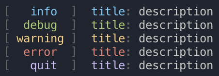

# :pushpin: pin

## Preview



## Description

`pin` is a very simple library that makes logging in your bash scripts much easier !

## How to use

```bash
git clone https://github.com/gawlk/pin.git
cd pin
bash install.sh
```

## Manual

Example: `pin i test` or `pin info "title" "description"`

Logs:
- `pin info "title" "description"` : Display an info pin
- `pin debug "title" "description"`: Display a debug pin (default: hidden)
- `pin warning "title" "description"`: Display a warning pin
- `pin error "title" "description"`: Display an error pin and quit
- `pin quit "title" "description"`: Display an info pin and quit

Setters:
- `pin log on`: Show info pins
- `pin log off`: Hide info pins
- `pin dev on`: Show debug pins
- `pin dev off`: Hide debug pins
