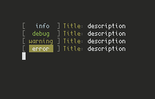

# logs

## Description

`logs` is a very simple library that I made because I realized that everytime I'm writing a script, I always write the same functions for errors or quitting, over and over again.
So I decided to write them properly in a file but then I realized that I needed something similar to what offer other programming languages, loggings and these how I came up with this easy to use and straightforward library.

Bonus: It has colors !

## Installation 

It's very easy:
1. Download and put the script in your path (most likely `~/.bin`)
2. In your scripts you add this line somewhere at the top: `. logs` (it will import all the functions of my library)
3. That's it, you can now use the available functions !

## Manual

Example: `log.info "test" "test"`

Available printers:
- `log.info` : Display information
- `log.debug`: Used for debugging (default: hidden)
- `log.warning`: Used for warnings
- `log.error`: Display error and quit
- `log.quit`: Display info and quit

Available setters:
- `log.quiet`: Hide `log.info`
- `log.loud`: Show `log.info`
- `log.dev`: Show `log.debug`
- `log.casual`: Hide `log.debug`
